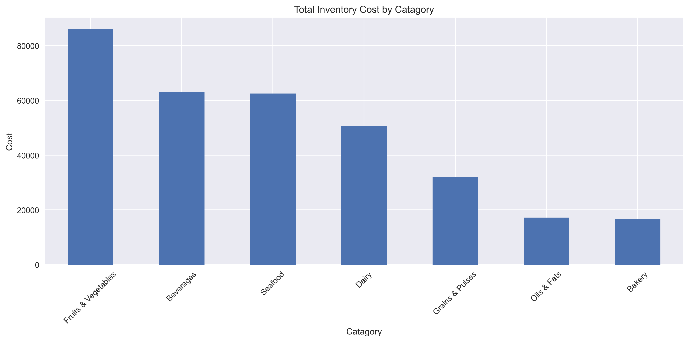
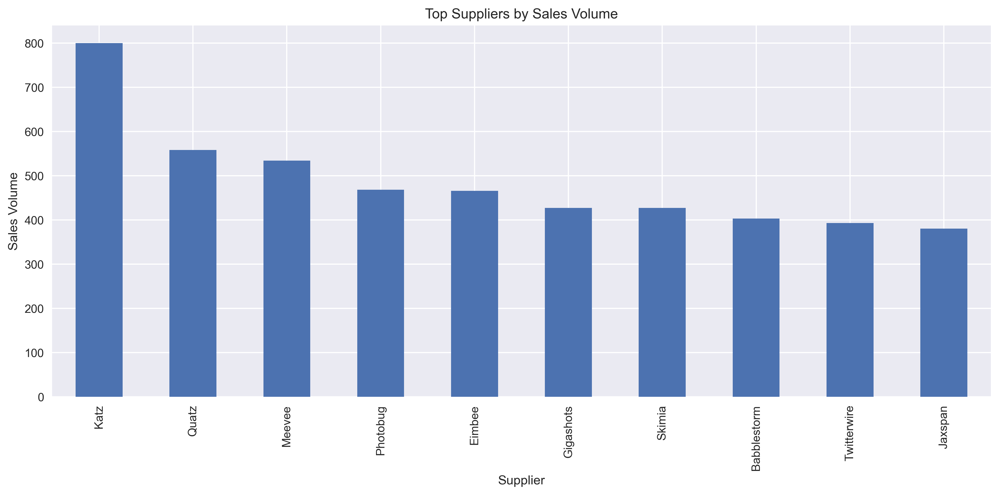
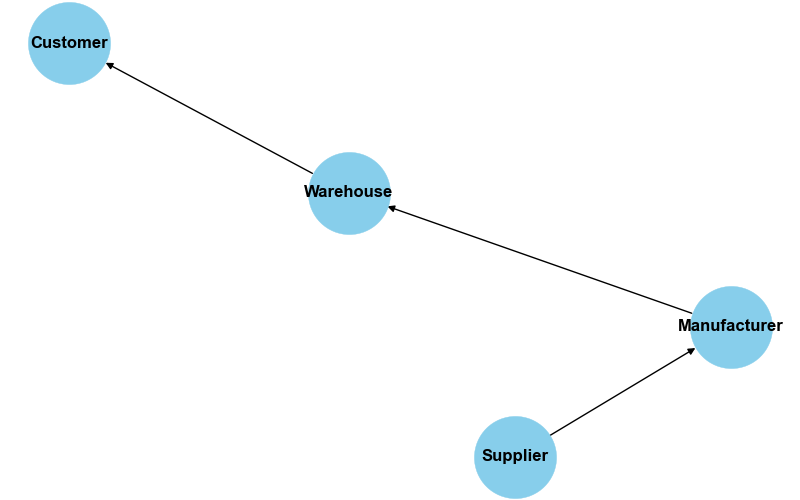

# Supply Chain Optimization & Inventory Analytics

     Executive Summary

This project applies data analytics techniques to evaluate and optimize a grocery supply chain. The analysis focuses on inventory performance, supplier contribution, delivery efficiency, and operational costs to identify opportunities for improving overall supply chain performance.

The project combines exploratory data analysis (EDA), KPI development, supply chain modeling, and scenario-based optimization to support data-driven business decisions.

     Business Objective

The objective of this project is to improve supply chain efficiency by:

* Reducing inventory-related costs
* Improving delivery performance
* Optimizing inventory levels
* Enhancing operational visibility
* Supporting data-driven decision-making

---

     Supply Chain Model

The analysis focuses on the following supply chain structure:

**Supplier → Manufacturer → Warehouse → Customer**

This model was used to evaluate inventory flow, operational performance, and potential optimization opportunities throughout the supply chain.

     Analytical Approach

The project was developed using Python and business analytics methodologies to:

* Analyze inventory costs across product categories
* Evaluate supplier performance using sales volume
* Measure delivery performance
* Assess inventory risk and stock levels
* Develop operational KPIs
* Simulate optimization scenarios

---
      Key Findings

### Inventory Cost Analysis

Inventory cost analysis revealed significant differences between product categories. Certain categories represented a disproportionately large share of total inventory investment, highlighting opportunities for inventory optimization and cost reduction.

### Supplier Performance Analysis

Supplier sales analysis showed that a small group of suppliers generated the highest sales volumes. These suppliers play a critical role in maintaining supply chain performance and should be prioritized for supplier relationship management and procurement planning.

### Supply Chain Visibility

The supply chain flow model provided a clear representation of product movement from suppliers to customers, improving operational visibility and supporting process evaluation.

### KPI Performance

| Metric            | Before       | After     |
|------------------|-------------|-------------|
| Inventory Cost   | 336.014859  | 302.413373  |
| Delivery Time    | -2.710101   | -2.168081   |
| Inventory Level  | 55.609091   | 47.267727   |

Key operational metrics were developed to measure:

* Inventory Cost
* Delivery Time
* Inventory Levels

After optimization, the system shows clear improvement across all key metrics. Inventory cost decreased significantly, indicating better cost efficiency and reduced overstocking. Delivery time improved (values moved closer to optimal range), suggesting faster and more stable logistics performance. Inventory levels also dropped, reflecting a leaner and more efficient supply chain.

Overall, the results confirm that the optimization approach successfully improved operational efficiency and reduced costs.

     Optimization Scenarios

Several improvement scenarios were evaluated:

### Cost Reduction

Simulated inventory cost reductions to assess potential financial benefits and operational impact.

### Delivery Improvement

Evaluated opportunities to reduce delivery times and improve service performance.

### Inventory Optimization

Analyzed inventory levels to identify opportunities for reducing excess stock while maintaining product availability.

     Business Impact

The analysis demonstrates how data analytics can support:

* Supply Chain Optimization
* Inventory Management
* Supplier Performance Monitoring
* Operational Efficiency
* KPI-Driven Decision Making

The project highlights how organizations can leverage analytics to improve visibility, reduce costs, and enhance overall supply chain performance.

     Technologies

* Python
* Pandas
* NumPy
* Matplotlib
* Seaborn
* NetworkX
* Jupyter Notebook

---

      Skills Demonstrated

* Supply Chain Analytics
* Business Analytics
* Exploratory Data Analysis (EDA)
* KPI Development
* Data Visualization
* Inventory Optimization
* Operational Performance Analysis
* Data-Driven Decision Making

---
      Author
  

**Dési Essis**

MBA in Data Science & Artificial Intelligence
